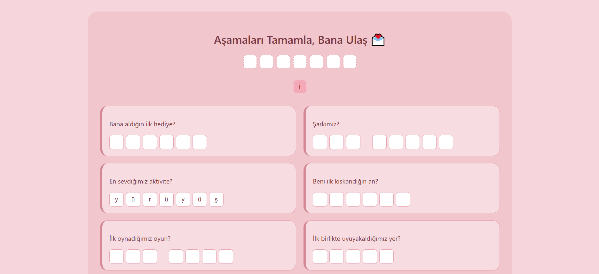
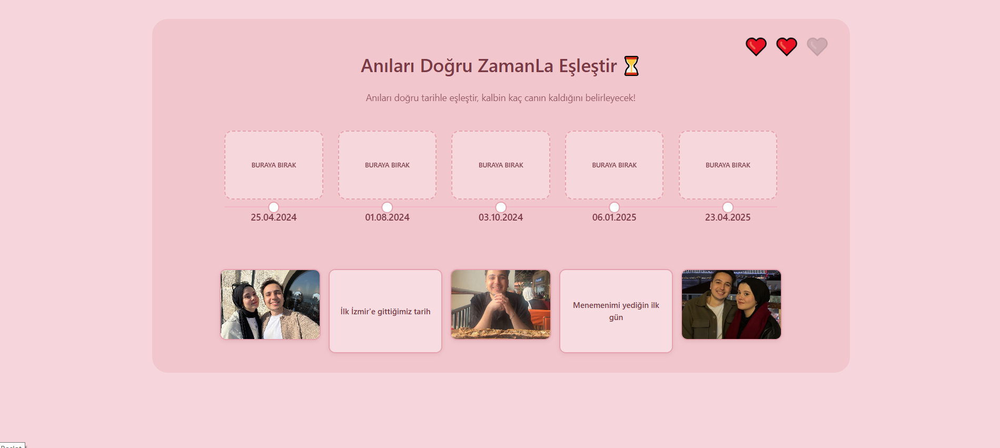
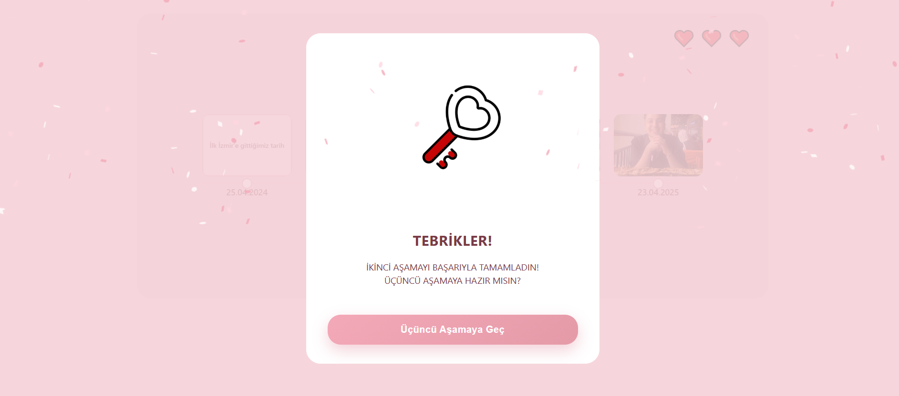
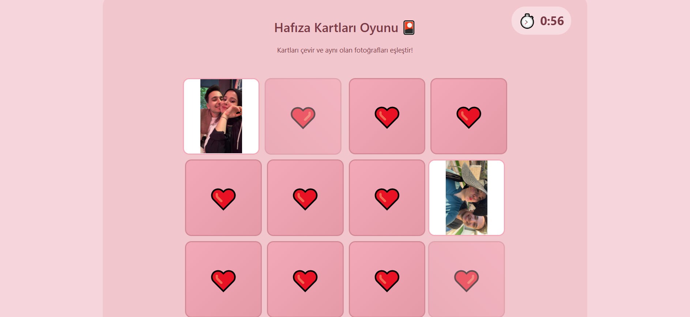
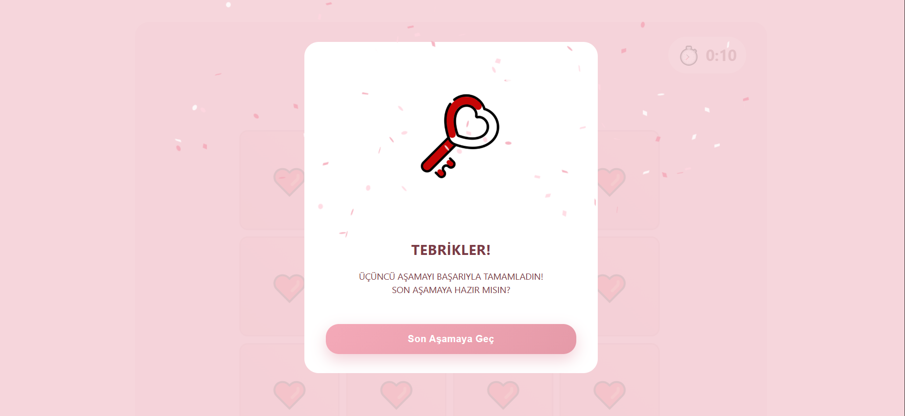
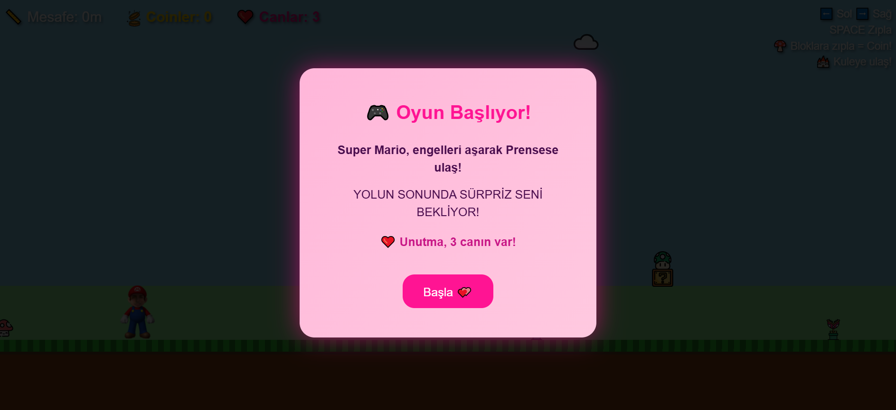
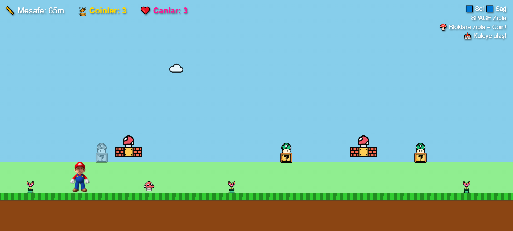
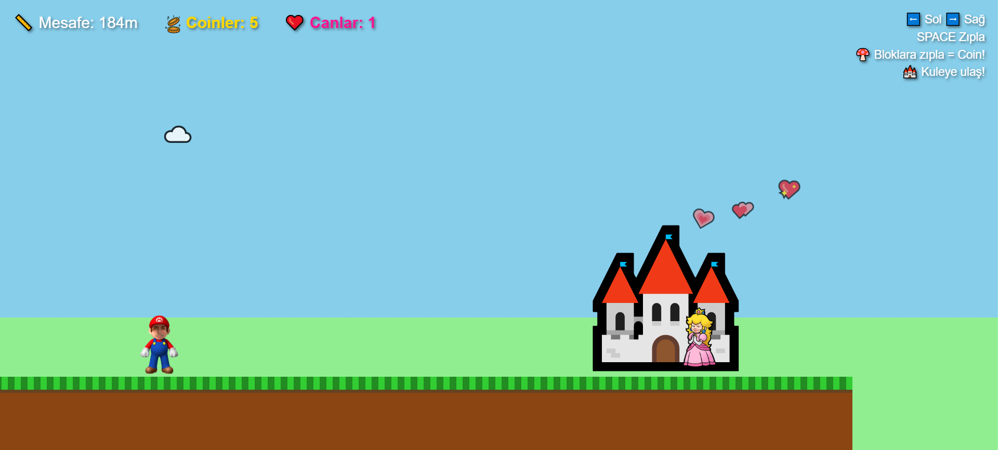
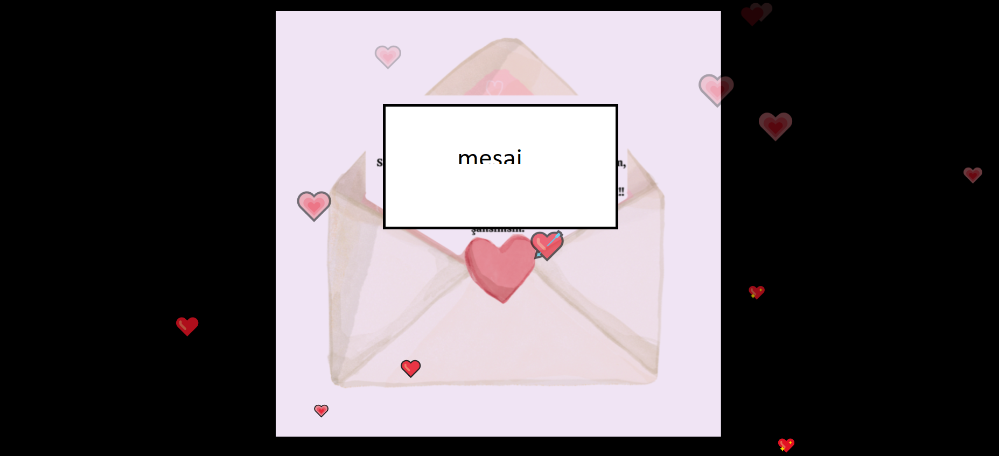

# ❤️ Valentine's Day Interactive Game

A 4-level interactive Valentine's Day web experience built with HTML, CSS and JavaScript.

---

## Project Overview

This project is a multi-stage interactive web game designed as a Valentine's Day experience.  
Each stage introduces a different game mechanic and progresses sequentially.

---

## Stages

### Stage 1 – Word Puzzle (Encrypted Phrase)
Users fill in missing letters to reveal a hidden password phrase.

### Stage 2 – Date-Event Matching
Users match important dates with corresponding events.

### Stage 3 – Memory Game
Classic card matching memory game mechanic.

### Stage 4 – Mario-Style Platform Game
Mini platform game inspired by classic Mario mechanics.

---

## Technologies Used

- HTML5
- CSS3
- Vanilla JavaScript

---

## Project Structure

├── index.html
├── stage2.html
├── stage3.html
├── stage4.html
├── css/
├── js/
└── assets/

## Screenshots

### Stage 1

### Stage 2

### Stage 2 Tamamlandı

### Stage 3

### Stage 3 Tamamlandı

### Stage 4 Başlangıç

### Stage 4 

### Stage 4 Final

### Final

--

## Author

Dilara Karaca